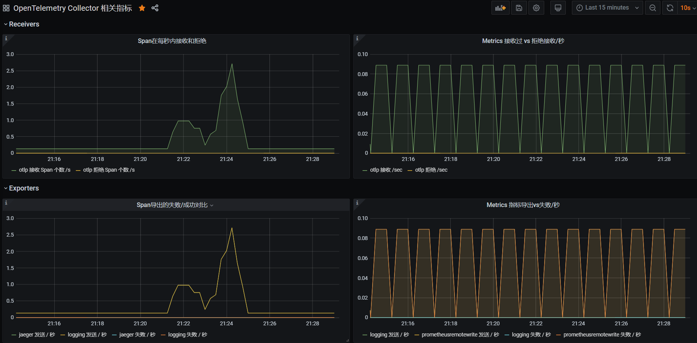
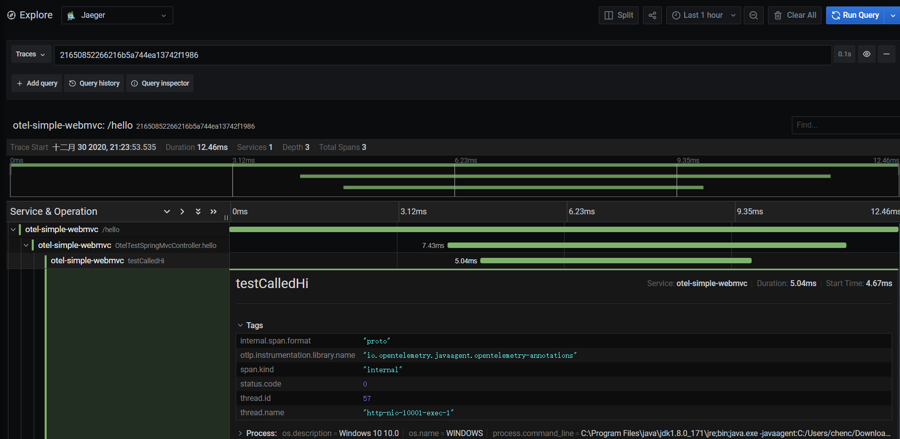
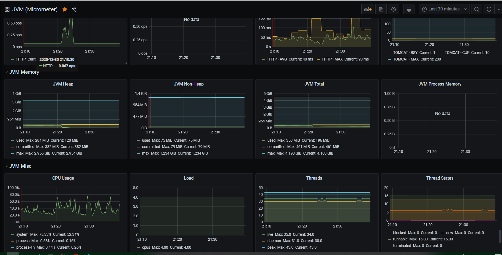
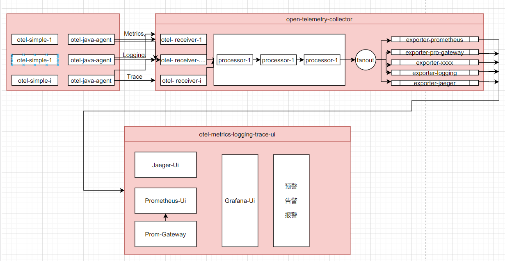

### Open-Telemetry-Java-Guides 案例工程

> Open-Telemetry-Java-Guides案例，用于测试常用中间件支持及Otel相关组件的使用情况。关于更多Otel请访问Otel官网。

必读部分：[数据展示](#数据展示)、 [前言](#前言)、[环境准备](#环境准备)、[参数设置](#参数设置)，
[启动测试服务](#启动测试服务)、[结果观测](#结果观测)、[测试服务列表](#测试服务列表)、[测试环境](#测试环境)、[测试库及框架列表](#测试库及框架列表).

> 🔈：希望各位先fork，后clone,这样关于我新提交的东西您就可以观测到。如果仅仅clone，我的最新提交您可能感知不到。
个人无偿测试和搭建不易，麻烦赏颗星星，感谢您。🙇‍。

#### 数据展示

Otel-Col Info By ItSelf :



App-Trace Info By Jaeger:



App-Jvm-Metrics Info By Prometheus And Prometheus Gateway:



关于业务日志, 借助对应的日志框架实现自定义即可。
例如LogBack，自定义其Layout以及Appender， 借助第三方例如Kafka，将数据exporter至当前Otel-Col即可。

中心化管控：Biz Logging, Trace, Metrics 较为方便。还未尝试Otel让 个人 最惊喜的Tail-Base-Smaple规则。

#### 前言 

- Open Template(下面简称Otel)[相关资料及文档](https://opentelemetry.io/docs/java/getting_started/)。

- 搭建最小测试版的guides服务，仅仅是为了体验和测试Otel，故此数据仅存于内存中。

- arch: 

#### 环境准备

1. ~~暂时不~~选择Otel-Collector，选择使用最小版Jaeger进行观测。关于[如何安装All in One](https://www.jaegertracing.io/docs/1.16/getting-started/)的Jaeger。

2. 下载[Otel-Javaagent.jar](https://github.com/open-telemetry/opentelemetry-java-instrumentation/releases/download/v0.12.0/opentelemetry-javaagent-all.jar)至磁盘目录下,[关于Latest release](https://github.com/open-telemetry/opentelemetry-java-instrumentation/releases) ，目前[最新版本为Beta 0.12.0](https://github.com/open-telemetry/opentelemetry-java-instrumentation/releases/tag/v0.12.0)。

3. 拉取[Otel-Col-Docker-Image](https://hub.docker.com/search?q=otel&type=image).

4. 关于docker 安装相关组件请移步[这儿](https://github.com/chenmudu/open-telemetry-java-guides/tree/master/config/others.properties)

#### 参数设置

1. 设置VmOptions,指向磁盘中的otel-javaagent.jar的置放目录。
```sh
java -javaagent:path/to/opentelemetry-javaagent-all.jar
```
2. 设置VmOptions,关于Exporter,otel默认为自己的OTLP Exporter,这里我们选择~~使用zipkin作为默认Exporter，其兼容jaeger的RestApi。使用Http方式上报至Jaeger的Collector中(~~也可以使用Otel-Collector~~)~~。
```sh
-Dotel.exporter=zipkin
```
3. 向Environment variable添加参数对：
```sh
OTEL_EXPORTER_ZIPKIN_SERVICE_NAME = jvm instance name
```

4. 关于[Otel官方参数设置。](https://github.com/open-telemetry/opentelemetry-java-instrumentation#getting-started)

#### 关于Otel-Collector

1. Docker/Windows 安装 Otel-Collector即可。

2. 向Environment variable添加参数对：
```sh
OTEL_RESOURCE_ATTRIBUTES=service.name=your service name
```
3. 关于[Otel-Collector-Design](https://github.com/open-telemetry/opentelemetry-collector/blob/master/docs/design.md)

#### 启动测试服务

 git clone 当前项目. 选择测试的模块(确保[环境准备](#环境准备)、[参数设置](#参数设置)已经完成)。详情请进入子模块测试服务read me file,启动子模块。
 
#### 结果观测

1. 确保[环境准备](#环境准备)、[参数设置](#参数设置)，[启动测试服务](#启动测试服务)已按步完成。

2. 访问Jaeger-Ui即可观测结果，按步完成后UI默认地址为:http://localhost:16686/。


#### 测试服务列表

* [Open-Telemetry-Java 示例工程（基于 Spring   MVC 示例WebMvc）](otel-simple-webmvc)
* [Open-Telemetry-Java 示例工程（基于 Rest Clients 示例RestClient）](otel-simple-restclient)
* [Open-Telemetry-Java 示例工程（基于 Spring Webflux 示例WebFlux）](otel-simple-webflux)
* [Open-Telemetry-Java 示例工程（基于 Spring Rdb 示例Rdb）](otel-simple-rdb)
* [Open-Telemetry-Java 示例工程（基于 Spring Async 示例Async）](otel-simple-async)
* [Open-Telemetry-Java 示例工程（基于 Spring Data 示例Data系列）](otel-simple-spring-data)
* [Open-Telemetry-Java 示例工程（关于 Otel Collector 个人配置参考）](https://github.com/chenmudu/open-telemetry-java-guides/tree/master/config/otel-col-config.yaml)

#### 测试环境

- JDK Version: 1.8.0_171

- Otel Java Agent Version: 0.12.0

- Otel Collector Win10 Version: 0.16.0

- Otel Collector Docker Version: 0.16.0-Dev

- Maven Version: 3.3.9

- IDEA Version: 2018.1.5 x64

- OS Version: Win10

- Docker Version: 19.03.13

- JVM Info: Java HotSpot(TM) 64-Bit Server VM (25.171-b11, mixed mode)

- Others：Prometheus, Prometheus Gateway, Jaeger All In One, Grafana ...

#### 测试库及框架列表

| Library/Framework         | Versions                       |Test Result               |
|---------------------------|--------------------------------|--------------------------|
| Servlet                   | 4.0                            |Y                         |
| WebMvc                    | 5.1.15                         |Y                         |
| WebFlux                   | 5.1.15                         |Y                         |
| RestTemplate(sync & async)| 5.1.15                         |N/Y(错当rest temeplate为http client. 且不支持 async resttemplate.)|
| ApacheHttpClient(sync & async)  | 4.5.12/4.1.4            |Y                         |
| HttpUrlConnection         | java8                          |Y                         |
| OkHttp(sync & async)      | 3.6.0                          |Y                         |
| JdbcMysqlConnector        | 8.0.22                          |Y                        |
| Spring-Data-Jdbc          | 2.1.14(1.0.17.RELEASE)                          |Y                        |
| Spring-Data-Jpa           | 2.1.14(2.1.17.RELEASE)                         |Y                        |
| Spring-Data-Rest          | 2.1.14(3.1.17.RELEASE)                          |Y                        |
| Spring-Data-Mongo         | 2.1.14(2.1.17.RELEASE)                          |Y                        |
| Spring-data-Redis         | 2.1.14(2.1.17.RELEASE)                          |Y                        |
| Spring-data-Es            | 2.1.14(3.1.17.RELEASE)                          |Y                        |
| Spring-data-Neo4j         | 2.1.14(5.1.17.RELEASE)                          |N 还未测试                        |
| .......                   | .....                          |Y                         |

#### 关于其他

- 单个服务应当部署单独的Otel-Agent去收集你的Logging、Trace、Metrics。

- 在每条业务架设对应的Otel-Col-Gateway去做总收集较为妥当(划分依据参考自身业务)。

- 至于更大的集群模式，请自行尝试。暂时切莫用于生产，待官方发布GA版本，个人将预先尝试。